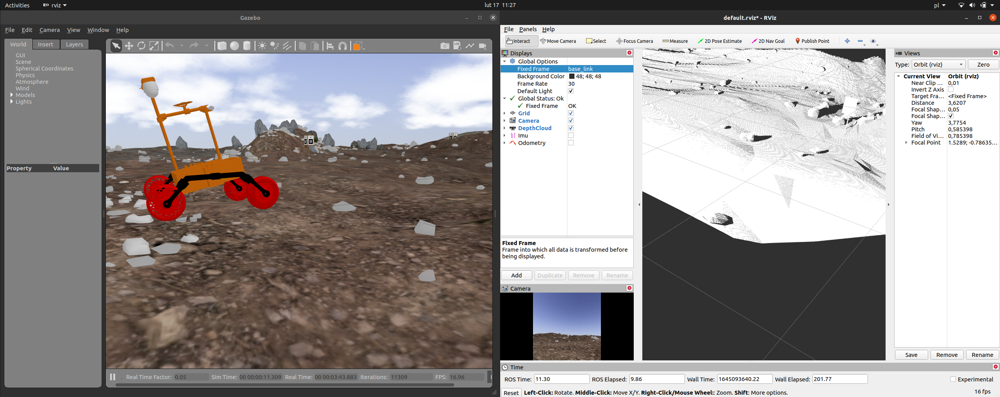

# simulation_rework



## Włączanie
* symulacja (klasyczny source najpierw)
```roslaunch scorpio7_gazebo scorpio7_world.launch ```
* rosbridge
```roslaunch rosbridge_server rosbridge_websocket.launch ```
* GUI app
```<przegladarka> index.html```

